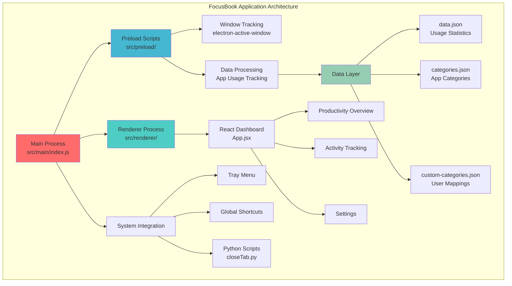
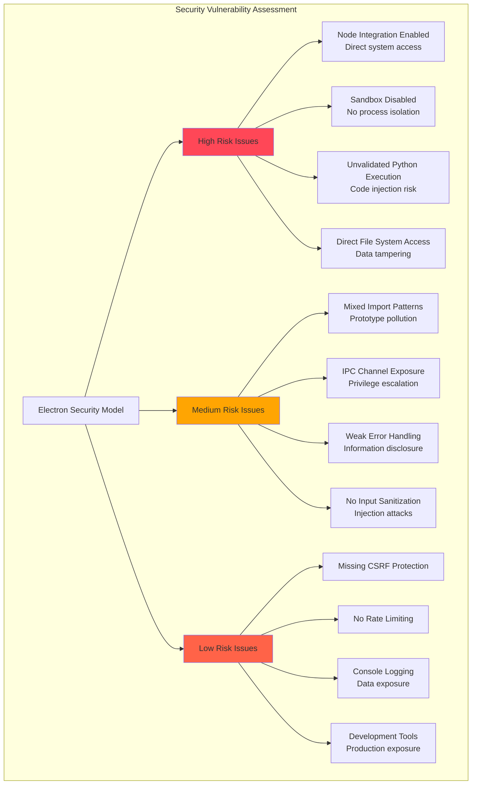
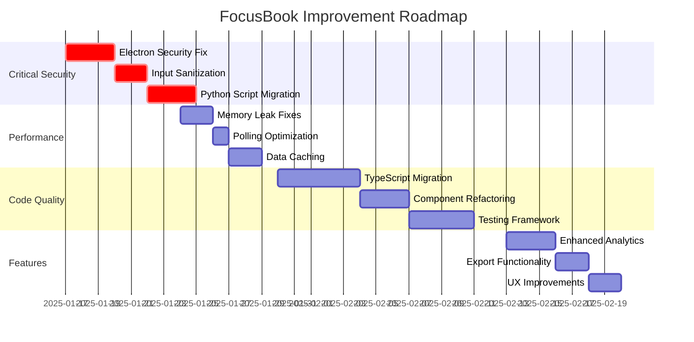

# FocusBook Application - Comprehensive Code Review

**Review Date:** January 16, 2025  
**Reviewer:** Claude Code  
**Application Version:** 1.0.0  
**Review Scope:** Complete codebase analysis including architecture, security, performance, and code quality

## Executive Summary

FocusBook is an Electron-based desktop application for tracking productivity and app usage. The application demonstrates solid architectural foundations with proper separation of concerns between main/preload/renderer processes. However, it contains several critical security vulnerabilities and performance issues that must be addressed before production deployment.

### Overall Assessment
- **Architecture:** ✅ Good - Clean process separation and modular design
- **Security:** ❌ Critical Issues - Multiple high-risk vulnerabilities
- **Performance:** ⚠️ Needs Improvement - Memory leaks and inefficient polling
- **Code Quality:** ⚠️ Needs Improvement - Mixed patterns and missing types
- **Maintainability:** ⚠️ Moderate - Good structure but lacks documentation

## Architecture Overview

### System Architecture



### Component Structure

The application follows a well-organized structure:
- **Main Process**: Handles window management, system integration, and file operations
- **Preload Scripts**: Bridge between main and renderer, manages app tracking
- **Renderer Process**: React-based UI with routing and data visualization
- **Data Layer**: JSON-based persistence with automatic backups

## Critical Security Issues

### 1. Electron Security Misconfiguration (CRITICAL)

**Location:** `src/main/index.js:27-32`

```javascript
webPreferences: {
    nodeIntegration: true,        // ❌ CRITICAL: Full Node.js access
    contextIsolation: true,       // ✅ Good but insufficient
    preload: path.join(__dirname, '../preload/index.js'),
    sandbox: false,               // ❌ CRITICAL: No process isolation
}
```

**Risk:** Remote code execution, privilege escalation
**Impact:** Complete system compromise possible

### 2. Unvalidated Python Script Execution (CRITICAL)

**Location:** `src/main/index.js:228-229`

```javascript
const closeScriptPath = path.join(__dirname, "../../scripts/closeTab.py")
const pythonProcess = spawn('python', [closeScriptPath, n_pid, app_name]);
```

**Risk:** Code injection through process parameters
**Impact:** Arbitrary command execution

### 3. PowerShell Command Injection (HIGH)

**Location:** `src/preload/index.js:92-93`

```javascript
const escapedPath = executablePath.replace(/'/g, "''").replace(/"/g, '`"');
const powershellCommand = `(Get-ItemProperty -Path '${escapedPath}' -ErrorAction SilentlyContinue).VersionInfo.FileDescription`;
```

**Risk:** Command injection through malicious file paths
**Impact:** Local privilege escalation

### 4. Insecure Data Storage (MEDIUM)

**Location:** `src/main/index.js:387-420`

- Usage data stored in plain text JSON files
- No encryption for sensitive tracking information
- Backup files accumulate without proper cleanup
- No access controls on data files

## Performance Issues

### 1. Memory Leaks (HIGH)

**Issues Identified:**
- Uncleared intervals in main process (`src/main/index.js:297-313`)
- Particle animation consuming CPU continuously (`src/renderer/src/components/layout/main-layout.jsx:33-104`)
- No cleanup of processed data objects
- Accumulating backup files without limits

### 2. Inefficient Polling Strategy (MEDIUM)

**Location:** `src/preload/index.js:555`

```javascript
setInterval(updateAppUsage, 30000); // 30-second polling too aggressive
```

**Issues:**
- 30-second polling interval too frequent
- No adaptive polling based on activity
- No debouncing for rapid window switches
- Excessive PowerShell calls for process details

### 3. Data Processing Inefficiencies (MEDIUM)

**Issues:**
- No caching for expensive computations
- Repeated data processing on every render
- No pagination for large datasets
- Inefficient algorithms for data aggregation

## Code Quality Issues

### 1. Mixed Module Systems (MEDIUM)

**Location:** Throughout codebase

```javascript
// Mixed patterns in same file
const { contextBridge, ipcRenderer } = require('electron'); // CommonJS
import { json } from 'stream/consumers';                     // ES6
```

**Impact:** Potential compatibility issues and confusion

### 2. Missing Type Safety (MEDIUM)

- TypeScript configuration exists but not properly implemented
- No type definitions for IPC communication
- Missing PropTypes for React components
- Inconsistent error handling patterns

### 3. Code Duplication (LOW)

**Examples:**
- Time formatting logic duplicated across files
- Similar data processing patterns in multiple functions
- Redundant error handling code

## Detailed Component Analysis

### Main Process (`src/main/index.js`)

**Strengths:**
- Proper window lifecycle management
- Comprehensive cleanup functions
- Good IPC handler organization

**Issues:**
- Security vulnerabilities (nodeIntegration, sandbox)
- Mixed import patterns
- Hardcoded file paths
- Insufficient error handling

### Preload Scripts (`src/preload/index.js`)

**Strengths:**
- Comprehensive app tracking functionality
- Proper contextBridge usage
- Good data aggregation logic

**Issues:**
- Security vulnerabilities (Python execution)
- Performance problems (aggressive polling)
- Memory leaks (uncleared intervals)
- Complex state management

### React Components

**Strengths:**
- Clean component architecture
- Proper separation of concerns
- Good use of React patterns

**Issues:**
- Performance problems (particle animations)
- Missing error boundaries
- No memoization for expensive operations
- Accessibility concerns

### Data Processing (`src/renderer/src/utils/dataProcessor.js`)

**Strengths:**
- Comprehensive data transformation functions
- Good separation of business logic
- Flexible time period handling

**Issues:**
- No caching mechanisms
- Inconsistent time format handling
- Missing data validation
- Performance bottlenecks for large datasets

## Build Configuration Analysis

### Electron Builder (`electron-builder.yml`)

**Issues:**
- Generic app ID instead of proper identifier
- Disabled code signing
- Generic update URL pointing to example.com
- Unnecessary file permissions in macOS entitlements

### Vite Configuration (`electron.vite.config.mjs`)

**Strengths:**
- Proper build process configuration
- Custom plugin for HTML file copying

**Issues:**
- No source map configuration for debugging
- Limited build optimization settings
- Missing TypeScript configuration

## Security Risk Assessment



## Recommendations by Priority

### Priority 1: Critical Security Fixes

#### 1.1 Electron Security Hardening
```javascript
// Recommended configuration
webPreferences: {
    nodeIntegration: false,           // ✅ Disable Node.js access
    contextIsolation: true,           // ✅ Keep enabled
    sandbox: true,                    // ✅ Enable sandboxing
    preload: path.join(__dirname, '../preload/index.js'),
    allowRunningInsecureContent: false, // ✅ Block insecure content
}
```

#### 1.2 Replace Python Scripts
- Migrate Python functionality to Node.js
- If keeping Python, implement proper validation
- Use parameterized execution instead of string concatenation

#### 1.3 Input Validation & Sanitization
- Validate all window data before processing
- Sanitize PowerShell command inputs
- Implement schema validation for IPC messages
- Add input length limits and type checking

### Priority 2: Performance Optimization

#### 2.1 Memory Management
- Implement proper cleanup for all intervals and timeouts
- Add data retention policies for usage history
- Implement LRU cache for processed data
- Add memory usage monitoring

#### 2.2 Polling Strategy Improvement
- Reduce polling frequency from 30s to 60s
- Implement adaptive polling based on activity
- Add debouncing for rapid window switches
- Use event-driven updates where possible

#### 2.3 Data Processing Optimization
- Implement memoization for expensive calculations
- Add pagination for large datasets
- Cache chart data to avoid reprocessing
- Implement incremental data updates

### Priority 3: Code Quality Improvements

#### 3.1 TypeScript Migration
- Configure TypeScript for entire project
- Convert JavaScript files to TypeScript
- Add proper type definitions for all APIs
- Implement strict type checking

#### 3.2 Component Architecture Refactoring
- Extract business logic from components
- Implement proper error boundaries
- Add loading states for all async operations
- Standardize component patterns

#### 3.3 Testing Framework Implementation
- Set up Jest and React Testing Library
- Add unit tests for data processing functions
- Implement integration tests for IPC communication
- Add E2E tests for critical user flows

### Priority 4: Feature Enhancements

#### 4.1 Enhanced Analytics
- Add productivity trends over time
- Implement goal setting and tracking
- Add detailed category insights
- Create productivity score algorithm

#### 4.2 Data Export & Import
- Implement CSV export functionality
- Add JSON export for data portability
- Create backup and restore features
- Add data synchronization options

## Implementation Roadmap



## Specific Code Changes Required

### 1. Main Process Security Fix

**File:** `src/main/index.js`

```javascript
// Current (INSECURE)
webPreferences: {
    nodeIntegration: true,
    contextIsolation: true,
    preload: path.join(__dirname, '../preload/index.js'),
    sandbox: false,
}

// Recommended (SECURE)
webPreferences: {
    nodeIntegration: false,
    contextIsolation: true,
    sandbox: true,
    preload: path.join(__dirname, '../preload/index.js'),
    allowRunningInsecureContent: false,
    webSecurity: true,
}
```

### 2. Polling Optimization

**File:** `src/preload/index.js`

```javascript
// Current (INEFFICIENT)
setInterval(updateAppUsage, 30000);

// Recommended (OPTIMIZED)
let pollingInterval = 60000; // Start with 60 seconds
let isUserActive = true;

function adaptivePolling() {
    const interval = isUserActive ? 60000 : 300000; // 1min active, 5min idle
    setTimeout(() => {
        updateAppUsage();
        adaptivePolling();
    }, interval);
}
```

### 3. Memory Leak Fix

**File:** `src/main/index.js`

```javascript
// Add proper cleanup
function cleanup() {
    isCleaningUp = true;
    
    // Clear all intervals
    if (timerInterval) {
        clearInterval(timerInterval);
        timerInterval = null;
    }
    
    // Clear other resources...
}

// Ensure cleanup on all exit scenarios
app.on('before-quit', cleanup);
app.on('window-all-closed', cleanup);
process.on('SIGTERM', cleanup);
process.on('SIGINT', cleanup);
```

## Testing Strategy

### Unit Tests
- Data processing functions
- Utility functions
- Component logic

### Integration Tests
- IPC communication
- File operations
- Window management

### End-to-End Tests
- Application startup/shutdown
- Data tracking workflow
- Settings management

### Security Tests
- Input validation
- File access permissions
- Process isolation

## Monitoring and Maintenance

### Performance Monitoring
- Memory usage tracking
- CPU utilization monitoring
- Data processing performance metrics
- Application startup time

### Error Tracking
- Implement crash reporting
- Add structured logging
- Monitor failed operations
- Track user-reported issues

### Data Integrity
- Validate data consistency
- Monitor backup operations
- Check file corruption
- Verify category mappings

## Conclusion

FocusBook demonstrates a solid architectural foundation with good separation of concerns and comprehensive functionality. However, the application requires immediate attention to critical security vulnerabilities before it can be safely deployed in production environments.

The most urgent issues are the Electron security misconfigurations and unvalidated script execution, which pose significant security risks. Performance optimizations and code quality improvements, while important, can be addressed in subsequent phases.

With proper implementation of the recommended fixes, FocusBook has the potential to become a robust and secure productivity tracking application. The modular architecture provides a solid foundation for future enhancements and maintenance.

### Estimated Effort
- **Critical Security Fixes:** 1-2 weeks
- **Performance Optimization:** 1-2 weeks  
- **Code Quality Improvements:** 3-4 weeks
- **Feature Enhancements:** 2-3 weeks

**Total Estimated Timeline:** 8-12 weeks for complete implementation

### Next Steps
1. Address critical security vulnerabilities immediately
2. Implement performance optimizations
3. Begin TypeScript migration
4. Establish testing framework
5. Plan feature enhancement roadmap

---

*This code review was generated using systematic analysis of the entire codebase, focusing on security, performance, maintainability, and architectural best practices.*